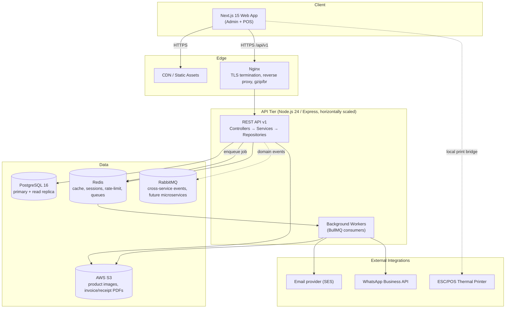
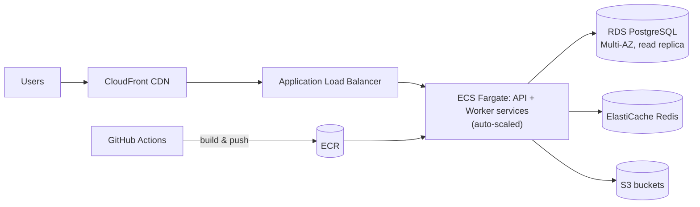

# UltisPro — System Architecture, High-Level Design & Technology Justification

## 1. Architecture Style

**Modular monolith, clean architecture, feature-based folders — not microservices, at launch.**

Rationale: at the scale of "thousands of SMB retail tenants," a well-factored modular monolith is cheaper to operate, easier to keep transactionally correct (a sale touches invoice + stock ledger + payment + loyalty in one commit), and faster to ship than a microservices mesh. Module boundaries are enforced at the *code* level (dependency-cruiser rules, one folder per bounded context, no cross-module reach-into-internals) so that any module can be extracted into its own service later without a rewrite — only its adapter layer changes.

Each backend module still follows Clean Architecture internally:

```
Controller (HTTP) → DTO validation → Service (use case) → Repository (data access) → PostgreSQL
                                            ↓
                                   Domain entities / business rules
```

- **Controllers** are thin: parse request, call service, map result to HTTP response.
- **Services** hold business rules and orchestrate repositories; they know nothing about Express or SQL.
- **Repositories** are the only place SQL/query-builder code lives; they return domain entities, not raw rows.
- **DTOs** (Zod schemas) validate and shape every request/response at the boundary.
- **Dependency Injection** via a lightweight container (tsyringe or manual factory functions) so services receive repository interfaces, not concrete classes — enabling unit tests with in-memory fakes.

## 2. High-Level Component Diagram



## 3. Multi-Tenancy Model

**Shared database, shared schema, row-level isolation by `organization_id`.**

| Option | Verdict |
|---|---|
| Database-per-tenant | Rejected for MVP — operationally expensive at "thousands of businesses" scale (migrations × N databases, connection pool limits) |
| Schema-per-tenant | Rejected — Postgres schema counts in the thousands degrade catalog performance and complicate pooling (PgBouncer) |
| **Shared schema + `organization_id` FK on every tenant table (chosen)** | Standard SaaS pattern (used by Zoho, Notion, Linear at this scale). Cheapest to operate, easiest to run cross-tenant analytics/ops on, scales to millions of rows per table with proper indexing |

Defense in depth on top of the app-layer `WHERE organization_id = :orgId` filter (which every repository method enforces via a shared query-builder base class so it cannot be forgotten):

- PostgreSQL **Row-Level Security (RLS)** policies on every tenant table, keyed off a session variable (`SET app.current_org_id`) set at the start of each request's DB transaction. This is a second, database-enforced guarantee — a bug in a repository method still cannot leak cross-tenant rows.
- All tenant tables indexed with `organization_id` as the leading column in composite indexes used for list/filter queries.

When a single tenant outgrows the shared model (very large chains), it can be moved to a dedicated database with no application code change — only a connection-routing config change — because every query is already scoped by `organization_id`.

## 4. Authentication & Authorization

- **JWT access token**: 15-minute expiry, signed with RS256, carries `sub` (user id), `org_id`, `store_ids[]`, `branch_ids[]`, `role`, and a `permissions` hash version (not the full permission list, to keep the token small).
- **Refresh token**: opaque random token, 30-day expiry, stored httpOnly + Secure + SameSite=Strict cookie, persisted server-side (hashed) in `refresh_tokens` table for revocation and rotation-on-use (detect token reuse → revoke whole family, per OWASP guidance).
- **Redis** holds a denylist of revoked access-token JTIs for immediate logout/kill-switch effect within the 15-minute window.
- **RBAC**: permissions are `module:action` strings (e.g. `inventory:adjust`, `sales:discount:approve`) grouped into roles; custom roles (P1) are just a different set of `role_permissions` rows — no schema change needed.
- Every mutating endpoint declares its required permission via middleware (`requirePermission('inventory:adjust')`), and the same permission constants drive which UI actions render — one source of truth (`packages/shared/permissions.ts`) consumed by both API and Next.js app.

## 5. Caching & Background Processing

- **Redis** responsibilities: session/refresh-token support, rate-limit counters (sliding window per IP + per user), hot-path caches (product catalog per branch, dashboard aggregates with short TTL + explicit invalidation on write), and as the **BullMQ** broker.
- **Background jobs (BullMQ, not Celery — see §8)**: invoice PDF rendering, email/WhatsApp receipt dispatch, low-stock/expiry alert scans (scheduled), heavy report exports (CSV/Excel/PDF), loyalty point recalculation, nightly reconciliation jobs. Keeping these off the request thread is what lets POS-01's <300ms budget hold even though "print a PDF and email it" can take seconds.
- **RabbitMQ**: reserved for cross-boundary domain events once a module is later split into its own service (e.g., `sale.completed` fanned out to inventory, loyalty, and analytics consumers). Not required for MVP's in-process module calls; introduced when the first module is actually extracted, to avoid speculative infrastructure.

## 6. API Conventions

- **Versioned**: all routes under `/api/v1/...`; breaking changes ship as `/api/v2` with the old version kept alive per a documented deprecation window.
- **Consistent envelope**:
  ```json
  { "success": true, "data": { ... }, "meta": { "page": 1, "pageSize": 20, "total": 134 } }
  ```
  Errors:
  ```json
  { "success": false, "error": { "code": "VALIDATION_ERROR", "message": "...", "details": [ ... ] } }
  ```
- **Pagination**: cursor-based for high-volume ledgers (stock ledger, audit log), offset-based (`page`/`pageSize`) elsewhere for simplicity.
- **Filtering/sorting/search**: standardized query params (`filter[field]`, `sort=-createdAt`, `q=`) implemented once in a shared query-parsing utility, reused by every list endpoint.
- **OpenAPI**: generated from the same Zod DTO schemas (`zod-to-openapi`) so the spec can never drift from validation reality; served at `/api/v1/docs` via Swagger UI.
- **HTTP status codes** used precisely: 200/201/204 for success, 400 validation, 401 unauthenticated, 403 unauthorized, 404 not found, 409 conflict (e.g., duplicate SKU), 422 business-rule violation, 429 rate-limited, 500 unhandled.

## 7. Security

| Concern | Mitigation |
|---|---|
| SQL injection | Parameterized queries only, enforced via query builder (Kysely) — no raw string concatenation |
| XSS | React's default escaping, `Content-Security-Policy` header, sanitize any rich-text fields |
| CSRF | SameSite=Strict cookies for refresh token; access token sent via Authorization header (not a cookie), which is inherently CSRF-immune |
| Rate limiting | Redis sliding-window limiter per IP and per user, tighter limits on `/auth/*` |
| Password storage | bcrypt (cost 12) |
| Secrets | AWS Secrets Manager / SSM Parameter Store, never in source or images |
| Transport | TLS 1.2+ everywhere, HSTS |
| Dependency hygiene | `npm audit` / Dependabot in CI |
| Input validation | Every endpoint validates via Zod DTO before touching a service |
| Audit trail | `audit_logs` table records actor, action, entity, before/after diff for all financial and stock mutations |

## 8. Technology Justification

| Layer | Choice | Why |
|---|---|---|
| Frontend framework | Next.js 15 (App Router) + React 19 | SSR/streaming for fast first paint on dashboards, file-based routing fits feature-based structure, React Server Components reduce client bundle for data-heavy admin screens |
| Styling/UI | Tailwind CSS + shadcn/ui | Matches the provided design system tokens directly (see 06-design-system.md) with no fighting a component library's own theme; shadcn components are copied into the repo, so they're fully customizable |
| Server state | TanStack Query | Caching, background refetch, and optimistic updates for POS actions out of the box |
| Client state | Zustand | Minimal boilerplate for POS-local state (current cart, held bills) that doesn't belong in server cache |
| Forms | React Hook Form + Zod resolver | Same Zod schemas validate client-side and server-side — one schema, two enforcement points |
| Charts | Recharts | Composable, matches dashboard/report needs (line, bar, sparkline) without a heavy charting engine |
| Backend runtime | Node.js 24 LTS + Express | Team already targets TypeScript end-to-end; Express is battle-tested, unopinionated enough to enforce our own clean-architecture layering |
| Database | PostgreSQL 16 | ACID transactions are non-negotiable for money and stock; JSONB columns give schema flexibility for vertical-specific product attributes without an EAV table explosion |
| Cache/queue broker | Redis | One piece of infra serving three needs (cache, rate-limit, BullMQ) — fewer moving parts than adding a separate cache layer |
| Job queue | **BullMQ (Redis-backed), not Celery** | The original brief listed Celery, which is a Python-ecosystem tool with no first-class Node client — running it alongside a Node/Express backend would mean maintaining a second Python worker runtime for no functional gain. BullMQ gives the same delayed/retryable/scheduled job semantics natively in TypeScript, sharing the same Redis instance already in the stack. **Flagged explicitly for your sign-off** since it deviates from the original tech list. |
| Message bus | RabbitMQ | Kept in the roadmap for when a module is extracted into its own service (see §5); not wired into MVP request paths to avoid unused infrastructure |
| Object storage | AWS S3 | Product images, generated invoice/receipt PDFs, export files — durable, cheap, CDN-fronted |
| Containerization | Docker + Docker Compose (local) | Reproducible dev environment identical to prod images |
| Reverse proxy | Nginx | TLS termination, gzip/brotli, static asset serving, WebSocket upgrade for future real-time features |
| Cloud | AWS (ECS Fargate for API/workers, RDS for Postgres, ElastiCache for Redis, S3, CloudFront) | Fully managed services minimize ops burden for a small team; ECS Fargate avoids managing EC2 fleets while still being cheaper than Lambda for a long-lived API process |
| CI/CD | GitHub Actions | Lint → typecheck → unit/integration tests → build Docker image → push to ECR → deploy to ECS, gated per environment (staging auto, prod manual approval) |

## 9. Observability

- Structured JSON logging (Pino) with request-id correlation propagated from Nginx through the API to background jobs.
- Health check endpoints (`/healthz`, `/readyz`) for ECS/ALB target group checks.
- Metrics: request latency/error-rate histograms exported in Prometheus format, scraped by CloudWatch/Grafana.
- `audit_logs` table doubles as a business-level audit trail independent of infra logs (see 03-database-design.md).

## 10. Deployment Topology (target)



**Implementation note — production Postgres deviation:** the target above (§8, §10) scopes RDS PostgreSQL for production. In practice, production Postgres is running on [Neon](https://neon.tech) (serverless Postgres) instead — no RDS instance was provisioned. Neon was chosen for zero infrastructure management and instant database branching (useful for a staging environment that mirrors production without copying it manually); the tradeoff is losing RDS's native Multi-AZ failover and the read-replica topology shown above (Neon's compute autoscaling and branching are not the same guarantee as a synchronous standby). ECS/ElastiCache/S3/CloudFront for the rest of the stack are unaffected — this is a database-hosting swap, not a broader cloud-provider change, and the app only depends on `DATABASE_URL` being a valid Postgres connection string, so nothing in application code changed. See `README.md`'s "Database setup → Production (Neon)" section for the concrete setup steps. **Flagged for sign-off** the same way the BullMQ/Celery deviation above was — if RDS Multi-AZ's stronger availability guarantee turns out to matter before this goes past a pilot, revisit before launch.

## 11. Repository / Folder Structure (preview — detailed per-module structure ships with each module)

```
ultispro/
├── apps/
│   ├── web/                # Next.js 15 app (App Router, feature-based routes)
│   └── api/                # Express API
│       └── src/
│           ├── modules/    # one folder per bounded context (auth, products, inventory, sales, ...)
│           │   └── <module>/
│           │       ├── controllers/
│           │       ├── services/
│           │       ├── repositories/
│           │       ├── dtos/
│           │       ├── entities/
│           │       └── <module>.routes.ts
│           ├── shared/      # error handling, middleware, logger, DI container
│           └── workers/     # BullMQ job processors
├── packages/
│   ├── shared-types/        # Zod DTOs + TS types shared by web & api
│   └── config/              # eslint, tsconfig, tailwind presets
├── infra/
│   ├── docker/
│   ├── nginx/
│   └── github-actions/
└── docs/                    # this planning package
```

This is expanded with real files starting the moment you approve Phase 1 of the roadmap (see 05-development-roadmap.md).
