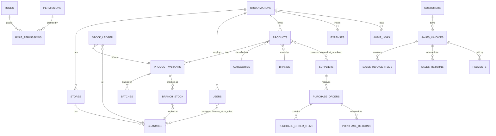

# UltisPro — Database Design

PostgreSQL 16. UUID primary keys (`gen_random_uuid()` via `pgcrypto`). Every tenant-scoped table carries `organization_id`, `created_at`, `updated_at`, `created_by`, `updated_by`, `deleted_at` (soft delete — nothing is ever hard-deleted; see 01-functional-requirements.md §5). A shared `set_updated_at()` trigger stamps `updated_at` on every `UPDATE`. Row-Level Security is enabled on every tenant table (see 02-system-architecture.md §3); policies are added in migration `0002_rls_policies.sql`, omitted below for readability.

## 1. Entity Relationship Overview



## 2. Conventions (applies to every table below unless noted)

```sql
CREATE EXTENSION IF NOT EXISTS pgcrypto;

CREATE OR REPLACE FUNCTION set_updated_at() RETURNS trigger AS $$
BEGIN
  NEW.updated_at = now();
  RETURN NEW;
END;
$$ LANGUAGE plpgsql;

-- Convention applied to every tenant table:
--   id             UUID PRIMARY KEY DEFAULT gen_random_uuid()
--   organization_id UUID NOT NULL REFERENCES organizations(id)
--   created_at     TIMESTAMPTZ NOT NULL DEFAULT now()
--   updated_at     TIMESTAMPTZ NOT NULL DEFAULT now()
--   created_by     UUID REFERENCES users(id)
--   updated_by     UUID REFERENCES users(id)
--   deleted_at     TIMESTAMPTZ NULL   -- soft delete marker
```

## 3. Domain: Platform & Tenancy

```sql
CREATE TABLE organizations (
  id                 UUID PRIMARY KEY DEFAULT gen_random_uuid(),
  legal_name         VARCHAR(255) NOT NULL,
  display_name       VARCHAR(255) NOT NULL,
  business_type      VARCHAR(50) NOT NULL DEFAULT 'general'
                       CHECK (business_type IN ('general','clothing','supermarket','electronics','mobile','grocery','pharmacy','hardware')),
  default_currency   CHAR(3) NOT NULL DEFAULT 'INR',
  timezone           VARCHAR(64) NOT NULL DEFAULT 'Asia/Kolkata',
  subscription_plan  VARCHAR(50) NOT NULL DEFAULT 'trial',
  is_active          BOOLEAN NOT NULL DEFAULT true,
  created_at         TIMESTAMPTZ NOT NULL DEFAULT now(),
  updated_at         TIMESTAMPTZ NOT NULL DEFAULT now(),
  deleted_at         TIMESTAMPTZ
);

CREATE TABLE stores (
  id                UUID PRIMARY KEY DEFAULT gen_random_uuid(),
  organization_id   UUID NOT NULL REFERENCES organizations(id),
  name              VARCHAR(255) NOT NULL,
  gstin             VARCHAR(15),
  invoice_prefix    VARCHAR(10) NOT NULL DEFAULT 'INV',
  next_invoice_seq  BIGINT NOT NULL DEFAULT 1,
  address_line1     VARCHAR(255),
  address_line2     VARCHAR(255),
  city              VARCHAR(100),
  state             VARCHAR(100),
  postal_code       VARCHAR(20),
  country           VARCHAR(100) NOT NULL DEFAULT 'India',
  created_at        TIMESTAMPTZ NOT NULL DEFAULT now(),
  updated_at        TIMESTAMPTZ NOT NULL DEFAULT now(),
  created_by        UUID,
  updated_by        UUID,
  deleted_at        TIMESTAMPTZ,
  UNIQUE (organization_id, gstin)
);
CREATE INDEX idx_stores_org ON stores(organization_id) WHERE deleted_at IS NULL;

CREATE TABLE branches (
  id              UUID PRIMARY KEY DEFAULT gen_random_uuid(),
  organization_id UUID NOT NULL REFERENCES organizations(id),
  store_id        UUID NOT NULL REFERENCES stores(id),
  name            VARCHAR(255) NOT NULL,
  code            VARCHAR(20) NOT NULL,
  address_line1   VARCHAR(255),
  city            VARCHAR(100),
  state           VARCHAR(100),
  postal_code     VARCHAR(20),
  phone           VARCHAR(20),
  is_active       BOOLEAN NOT NULL DEFAULT true,
  created_at      TIMESTAMPTZ NOT NULL DEFAULT now(),
  updated_at      TIMESTAMPTZ NOT NULL DEFAULT now(),
  created_by      UUID,
  updated_by      UUID,
  deleted_at      TIMESTAMPTZ,
  UNIQUE (store_id, code)
);
CREATE INDEX idx_branches_org ON branches(organization_id) WHERE deleted_at IS NULL;

CREATE TABLE warehouses (
  id              UUID PRIMARY KEY DEFAULT gen_random_uuid(),
  organization_id UUID NOT NULL REFERENCES organizations(id),
  branch_id       UUID REFERENCES branches(id), -- NULL = central/DC warehouse not tied to a sales branch
  name            VARCHAR(255) NOT NULL,
  code            VARCHAR(20) NOT NULL,
  is_active       BOOLEAN NOT NULL DEFAULT true,
  created_at      TIMESTAMPTZ NOT NULL DEFAULT now(),
  updated_at      TIMESTAMPTZ NOT NULL DEFAULT now(),
  deleted_at      TIMESTAMPTZ,
  UNIQUE (organization_id, code)
);
```

## 4. Domain: Identity & Access

```sql
CREATE TABLE users (
  id                UUID PRIMARY KEY DEFAULT gen_random_uuid(),
  organization_id   UUID NOT NULL REFERENCES organizations(id),
  email             VARCHAR(255) NOT NULL,
  phone             VARCHAR(20),
  full_name         VARCHAR(255) NOT NULL,
  password_hash     VARCHAR(255) NOT NULL,
  is_active         BOOLEAN NOT NULL DEFAULT true,
  last_login_at     TIMESTAMPTZ,
  failed_login_count SMALLINT NOT NULL DEFAULT 0,
  locked_until      TIMESTAMPTZ,
  created_at        TIMESTAMPTZ NOT NULL DEFAULT now(),
  updated_at        TIMESTAMPTZ NOT NULL DEFAULT now(),
  created_by        UUID,
  updated_by        UUID,
  deleted_at        TIMESTAMPTZ,
  UNIQUE (email) -- global, not per-organization — see §11 changelog
);

CREATE TABLE roles (
  id              UUID PRIMARY KEY DEFAULT gen_random_uuid(),
  organization_id UUID REFERENCES organizations(id), -- NULL = system-defined role, shared across all orgs
  name            VARCHAR(100) NOT NULL,
  is_system       BOOLEAN NOT NULL DEFAULT false,
  created_at      TIMESTAMPTZ NOT NULL DEFAULT now(),
  updated_at      TIMESTAMPTZ NOT NULL DEFAULT now(),
  deleted_at      TIMESTAMPTZ
);

CREATE TABLE permissions (
  id          UUID PRIMARY KEY DEFAULT gen_random_uuid(),
  code        VARCHAR(100) NOT NULL UNIQUE, -- e.g. 'inventory:adjust', 'sales:discount:approve'
  module      VARCHAR(50) NOT NULL,
  description VARCHAR(255)
);

CREATE TABLE role_permissions (
  role_id       UUID NOT NULL REFERENCES roles(id) ON DELETE CASCADE,
  permission_id UUID NOT NULL REFERENCES permissions(id) ON DELETE CASCADE,
  PRIMARY KEY (role_id, permission_id)
);

-- A user's role can differ per store/branch (e.g. Manager at Branch A, Cashier at Branch B)
CREATE TABLE user_store_roles (
  id              UUID PRIMARY KEY DEFAULT gen_random_uuid(),
  organization_id UUID NOT NULL REFERENCES organizations(id),
  user_id         UUID NOT NULL REFERENCES users(id),
  branch_id       UUID NOT NULL REFERENCES branches(id),
  role_id         UUID NOT NULL REFERENCES roles(id),
  created_at      TIMESTAMPTZ NOT NULL DEFAULT now(),
  UNIQUE (user_id, branch_id)
);

CREATE TABLE refresh_tokens (
  id              UUID PRIMARY KEY DEFAULT gen_random_uuid(),
  user_id         UUID NOT NULL REFERENCES users(id),
  token_hash      VARCHAR(255) NOT NULL,
  family_id       UUID NOT NULL, -- rotation family; reuse of a revoked token revokes the whole family
  expires_at      TIMESTAMPTZ NOT NULL,
  revoked_at      TIMESTAMPTZ,
  created_at      TIMESTAMPTZ NOT NULL DEFAULT now(),
  UNIQUE (token_hash)
);
CREATE INDEX idx_refresh_tokens_user ON refresh_tokens(user_id);

-- Added during Phase 1 implementation (not in the original draft): backs FR AUTH-03.
CREATE TABLE password_reset_tokens (
  id          UUID PRIMARY KEY DEFAULT gen_random_uuid(),
  user_id     UUID NOT NULL REFERENCES users(id),
  token_hash  VARCHAR(255) NOT NULL UNIQUE,
  expires_at  TIMESTAMPTZ NOT NULL,
  used_at     TIMESTAMPTZ,
  created_at  TIMESTAMPTZ NOT NULL DEFAULT now()
);
```

## 5. Domain: Catalog

```sql
CREATE TABLE categories (
  id              UUID PRIMARY KEY DEFAULT gen_random_uuid(),
  organization_id UUID NOT NULL REFERENCES organizations(id),
  parent_id       UUID REFERENCES categories(id),
  name            VARCHAR(150) NOT NULL,
  created_at      TIMESTAMPTZ NOT NULL DEFAULT now(),
  updated_at      TIMESTAMPTZ NOT NULL DEFAULT now(),
  deleted_at      TIMESTAMPTZ,
  UNIQUE (organization_id, parent_id, name)
);

CREATE TABLE brands (
  id              UUID PRIMARY KEY DEFAULT gen_random_uuid(),
  organization_id UUID NOT NULL REFERENCES organizations(id),
  name            VARCHAR(150) NOT NULL,
  deleted_at      TIMESTAMPTZ,
  UNIQUE (organization_id, name)
);

CREATE TABLE units (
  id                UUID PRIMARY KEY DEFAULT gen_random_uuid(),
  organization_id   UUID NOT NULL REFERENCES organizations(id),
  name              VARCHAR(50) NOT NULL,   -- e.g. 'Piece', 'Kilogram', 'Box of 12'
  symbol            VARCHAR(10) NOT NULL,   -- 'pcs', 'kg', 'box'
  base_unit_id      UUID REFERENCES units(id), -- e.g. Box -> Piece
  conversion_factor NUMERIC(12,4) NOT NULL DEFAULT 1, -- 1 Box = 12 Piece
  deleted_at        TIMESTAMPTZ,
  UNIQUE (organization_id, symbol)
);

CREATE TABLE taxes (
  id              UUID PRIMARY KEY DEFAULT gen_random_uuid(),
  organization_id UUID NOT NULL REFERENCES organizations(id),
  name            VARCHAR(50) NOT NULL,   -- 'GST 18%'
  rate_percent    NUMERIC(5,2) NOT NULL,
  cgst_percent    NUMERIC(5,2) NOT NULL DEFAULT 0,
  sgst_percent    NUMERIC(5,2) NOT NULL DEFAULT 0,
  igst_percent    NUMERIC(5,2) NOT NULL DEFAULT 0,
  deleted_at      TIMESTAMPTZ,
  CHECK (rate_percent = cgst_percent + sgst_percent OR rate_percent = igst_percent)
);

CREATE TABLE products (
  id               UUID PRIMARY KEY DEFAULT gen_random_uuid(),
  organization_id  UUID NOT NULL REFERENCES organizations(id),
  category_id      UUID REFERENCES categories(id),
  brand_id         UUID REFERENCES brands(id),
  unit_id          UUID NOT NULL REFERENCES units(id),
  tax_id           UUID REFERENCES taxes(id),
  name             VARCHAR(255) NOT NULL,
  description      TEXT,
  hsn_code         VARCHAR(20),
  has_variants     BOOLEAN NOT NULL DEFAULT false,
  track_batches    BOOLEAN NOT NULL DEFAULT false, -- true for pharmacy/grocery expiry tracking
  is_active        BOOLEAN NOT NULL DEFAULT true,
  created_at       TIMESTAMPTZ NOT NULL DEFAULT now(),
  updated_at       TIMESTAMPTZ NOT NULL DEFAULT now(),
  created_by       UUID,
  updated_by       UUID,
  deleted_at       TIMESTAMPTZ
);
CREATE INDEX idx_products_org_active ON products(organization_id) WHERE deleted_at IS NULL;
CREATE INDEX idx_products_name_trgm ON products USING gin (name gin_trgm_ops); -- requires pg_trgm, powers type-ahead search

-- A simple product has exactly one implicit variant row (keeps stock/pricing logic uniform);
-- a variant product (e.g. clothing size/color) has one row per SKU.
CREATE TABLE product_variants (
  id               UUID PRIMARY KEY DEFAULT gen_random_uuid(),
  organization_id  UUID NOT NULL REFERENCES organizations(id),
  product_id       UUID NOT NULL REFERENCES products(id),
  sku              VARCHAR(100) NOT NULL,
  barcode          VARCHAR(100),
  attributes       JSONB NOT NULL DEFAULT '{}', -- {"size":"M","color":"Blue"}
  mrp              NUMERIC(12,2) NOT NULL,
  selling_price    NUMERIC(12,2) NOT NULL,
  purchase_price   NUMERIC(12,2) NOT NULL DEFAULT 0,
  reorder_level    INTEGER NOT NULL DEFAULT 0,
  is_active        BOOLEAN NOT NULL DEFAULT true,
  created_at       TIMESTAMPTZ NOT NULL DEFAULT now(),
  updated_at       TIMESTAMPTZ NOT NULL DEFAULT now(),
  deleted_at       TIMESTAMPTZ,
  UNIQUE (organization_id, sku),
  UNIQUE (organization_id, barcode)
);
CREATE INDEX idx_variants_product ON product_variants(product_id) WHERE deleted_at IS NULL;
CREATE INDEX idx_variants_barcode ON product_variants(barcode) WHERE deleted_at IS NULL;

CREATE TABLE product_images (
  id           UUID PRIMARY KEY DEFAULT gen_random_uuid(),
  product_id   UUID NOT NULL REFERENCES products(id),
  s3_key       VARCHAR(500) NOT NULL,
  sort_order   SMALLINT NOT NULL DEFAULT 0,
  created_at   TIMESTAMPTZ NOT NULL DEFAULT now()
);

CREATE TABLE product_suppliers (
  product_id           UUID NOT NULL REFERENCES products(id),
  supplier_id          UUID NOT NULL REFERENCES suppliers(id),
  supplier_sku         VARCHAR(100),
  last_purchase_price  NUMERIC(12,2),
  PRIMARY KEY (product_id, supplier_id)
);
```

## 6. Domain: Inventory

```sql
CREATE TABLE batches (
  id               UUID PRIMARY KEY DEFAULT gen_random_uuid(),
  organization_id  UUID NOT NULL REFERENCES organizations(id),
  product_variant_id UUID NOT NULL REFERENCES product_variants(id),
  batch_number     VARCHAR(100) NOT NULL,
  manufactured_date DATE,
  expiry_date      DATE,
  purchase_price   NUMERIC(12,2),
  created_at       TIMESTAMPTZ NOT NULL DEFAULT now(),
  UNIQUE (organization_id, product_variant_id, batch_number)
);
CREATE INDEX idx_batches_expiry ON batches(expiry_date) WHERE expiry_date IS NOT NULL;

-- Current stock snapshot (denormalized for read speed; source of truth is stock_ledger).
CREATE TABLE branch_stock (
  id                  UUID PRIMARY KEY DEFAULT gen_random_uuid(),
  organization_id     UUID NOT NULL REFERENCES organizations(id),
  branch_id           UUID NOT NULL REFERENCES branches(id),
  product_variant_id  UUID NOT NULL REFERENCES product_variants(id),
  batch_id            UUID REFERENCES batches(id), -- NULL when product doesn't track batches
  quantity_on_hand    NUMERIC(14,4) NOT NULL DEFAULT 0,
  quantity_reserved   NUMERIC(14,4) NOT NULL DEFAULT 0, -- held bills / pending transfers
  updated_at          TIMESTAMPTZ NOT NULL DEFAULT now(),
  UNIQUE (branch_id, product_variant_id, batch_id)
);
CREATE INDEX idx_branch_stock_low ON branch_stock(branch_id, product_variant_id);

-- Immutable append-only ledger; branch_stock is a materialized rollup of this table.
CREATE TABLE stock_ledger (
  id                  UUID PRIMARY KEY DEFAULT gen_random_uuid(),
  organization_id     UUID NOT NULL REFERENCES organizations(id),
  branch_id           UUID NOT NULL REFERENCES branches(id),
  product_variant_id  UUID NOT NULL REFERENCES product_variants(id),
  batch_id            UUID REFERENCES batches(id),
  movement_type       VARCHAR(30) NOT NULL
                        CHECK (movement_type IN ('purchase','purchase_return','sale','sale_return',
                                                  'adjustment_in','adjustment_out','transfer_in','transfer_out')),
  reference_table     VARCHAR(50) NOT NULL, -- e.g. 'sales_invoices'
  reference_id        UUID NOT NULL,
  quantity_delta      NUMERIC(14,4) NOT NULL, -- signed
  balance_after        NUMERIC(14,4) NOT NULL,
  unit_cost           NUMERIC(12,4),          -- for COGS/valuation
  created_at          TIMESTAMPTZ NOT NULL DEFAULT now(),
  created_by          UUID
);
CREATE INDEX idx_stock_ledger_variant_branch ON stock_ledger(branch_id, product_variant_id, created_at);
CREATE INDEX idx_stock_ledger_reference ON stock_ledger(reference_table, reference_id);

CREATE TABLE stock_adjustments (
  id              UUID PRIMARY KEY DEFAULT gen_random_uuid(),
  organization_id UUID NOT NULL REFERENCES organizations(id),
  branch_id       UUID NOT NULL REFERENCES branches(id),
  reason_code     VARCHAR(50) NOT NULL, -- 'damage','theft','recount','expiry_writeoff',...
  notes           TEXT,
  approved_by     UUID REFERENCES users(id),
  created_at      TIMESTAMPTZ NOT NULL DEFAULT now(),
  created_by      UUID
);

CREATE TABLE stock_adjustment_items (
  id                    UUID PRIMARY KEY DEFAULT gen_random_uuid(),
  stock_adjustment_id   UUID NOT NULL REFERENCES stock_adjustments(id),
  product_variant_id    UUID NOT NULL REFERENCES product_variants(id),
  batch_id              UUID REFERENCES batches(id),
  quantity_delta        NUMERIC(14,4) NOT NULL
);

CREATE TABLE stock_transfers (
  id                UUID PRIMARY KEY DEFAULT gen_random_uuid(),
  organization_id   UUID NOT NULL REFERENCES organizations(id),
  from_branch_id    UUID NOT NULL REFERENCES branches(id),
  to_branch_id      UUID NOT NULL REFERENCES branches(id),
  status            VARCHAR(20) NOT NULL DEFAULT 'pending'
                      CHECK (status IN ('pending','in_transit','completed','cancelled')),
  created_at        TIMESTAMPTZ NOT NULL DEFAULT now(),
  created_by        UUID,
  completed_at      TIMESTAMPTZ
);

CREATE TABLE stock_transfer_items (
  id                   UUID PRIMARY KEY DEFAULT gen_random_uuid(),
  stock_transfer_id    UUID NOT NULL REFERENCES stock_transfers(id),
  product_variant_id   UUID NOT NULL REFERENCES product_variants(id),
  batch_id             UUID REFERENCES batches(id),
  quantity             NUMERIC(14,4) NOT NULL
);
```

## 7. Domain: Suppliers & Procurement

```sql
CREATE TABLE suppliers (
  id              UUID PRIMARY KEY DEFAULT gen_random_uuid(),
  organization_id UUID NOT NULL REFERENCES organizations(id),
  name            VARCHAR(255) NOT NULL,
  gstin           VARCHAR(15),
  phone           VARCHAR(20),
  email           VARCHAR(255),
  payment_terms_days SMALLINT NOT NULL DEFAULT 0,
  outstanding_balance NUMERIC(14,2) NOT NULL DEFAULT 0,
  is_active       BOOLEAN NOT NULL DEFAULT true,
  created_at      TIMESTAMPTZ NOT NULL DEFAULT now(),
  updated_at      TIMESTAMPTZ NOT NULL DEFAULT now(),
  deleted_at      TIMESTAMPTZ
);

CREATE TABLE purchase_orders (
  id              UUID PRIMARY KEY DEFAULT gen_random_uuid(),
  organization_id UUID NOT NULL REFERENCES organizations(id),
  branch_id       UUID NOT NULL REFERENCES branches(id),
  supplier_id     UUID NOT NULL REFERENCES suppliers(id),
  po_number       VARCHAR(50) NOT NULL,
  status          VARCHAR(20) NOT NULL DEFAULT 'draft'
                    CHECK (status IN ('draft','approved','partially_received','received','cancelled')),
  order_date      DATE NOT NULL DEFAULT CURRENT_DATE,
  expected_date   DATE,
  subtotal        NUMERIC(14,2) NOT NULL DEFAULT 0,
  tax_total       NUMERIC(14,2) NOT NULL DEFAULT 0,
  grand_total     NUMERIC(14,2) NOT NULL DEFAULT 0,
  created_at      TIMESTAMPTZ NOT NULL DEFAULT now(),
  created_by      UUID,
  approved_by     UUID REFERENCES users(id),
  deleted_at      TIMESTAMPTZ,
  UNIQUE (organization_id, po_number)
);

CREATE TABLE purchase_order_items (
  id                   UUID PRIMARY KEY DEFAULT gen_random_uuid(),
  purchase_order_id    UUID NOT NULL REFERENCES purchase_orders(id),
  product_variant_id   UUID NOT NULL REFERENCES product_variants(id),
  quantity_ordered     NUMERIC(14,4) NOT NULL,
  quantity_received    NUMERIC(14,4) NOT NULL DEFAULT 0,
  unit_cost            NUMERIC(12,4) NOT NULL,
  tax_id               UUID REFERENCES taxes(id),
  line_total           NUMERIC(14,2) NOT NULL
);

CREATE TABLE purchase_returns (
  id                  UUID PRIMARY KEY DEFAULT gen_random_uuid(),
  organization_id     UUID NOT NULL REFERENCES organizations(id),
  purchase_order_id   UUID NOT NULL REFERENCES purchase_orders(id),
  reason              TEXT,
  grand_total         NUMERIC(14,2) NOT NULL DEFAULT 0,
  created_at          TIMESTAMPTZ NOT NULL DEFAULT now(),
  created_by          UUID
);

CREATE TABLE purchase_return_items (
  id                    UUID PRIMARY KEY DEFAULT gen_random_uuid(),
  purchase_return_id    UUID NOT NULL REFERENCES purchase_returns(id),
  product_variant_id    UUID NOT NULL REFERENCES product_variants(id),
  batch_id              UUID REFERENCES batches(id),
  quantity               NUMERIC(14,4) NOT NULL,
  unit_cost              NUMERIC(12,4) NOT NULL
);

CREATE TABLE supplier_payments (
  id              UUID PRIMARY KEY DEFAULT gen_random_uuid(),
  organization_id UUID NOT NULL REFERENCES organizations(id),
  supplier_id     UUID NOT NULL REFERENCES suppliers(id),
  purchase_order_id UUID REFERENCES purchase_orders(id),
  amount          NUMERIC(14,2) NOT NULL,
  payment_mode    VARCHAR(20) NOT NULL CHECK (payment_mode IN ('cash','bank_transfer','cheque','upi','card')),
  paid_at         TIMESTAMPTZ NOT NULL DEFAULT now(),
  created_by      UUID
);
```

## 8. Domain: Customers & Sales

```sql
CREATE TABLE customers (
  id                  UUID PRIMARY KEY DEFAULT gen_random_uuid(),
  organization_id     UUID NOT NULL REFERENCES organizations(id),
  full_name           VARCHAR(255) NOT NULL,
  phone               VARCHAR(20),
  email               VARCHAR(255),
  gstin               VARCHAR(15),
  credit_limit        NUMERIC(14,2) NOT NULL DEFAULT 0,
  outstanding_balance NUMERIC(14,2) NOT NULL DEFAULT 0,
  loyalty_points      INTEGER NOT NULL DEFAULT 0,
  is_walkin           BOOLEAN NOT NULL DEFAULT false,
  created_at          TIMESTAMPTZ NOT NULL DEFAULT now(),
  updated_at          TIMESTAMPTZ NOT NULL DEFAULT now(),
  deleted_at          TIMESTAMPTZ,
  UNIQUE (organization_id, phone)
);

CREATE TABLE customer_addresses (
  id           UUID PRIMARY KEY DEFAULT gen_random_uuid(),
  customer_id  UUID NOT NULL REFERENCES customers(id),
  label        VARCHAR(50), -- 'Home','Shipping',...
  line1        VARCHAR(255),
  city         VARCHAR(100),
  state        VARCHAR(100),
  postal_code  VARCHAR(20),
  is_default   BOOLEAN NOT NULL DEFAULT false
);

CREATE TABLE held_bills (
  id              UUID PRIMARY KEY DEFAULT gen_random_uuid(),
  organization_id UUID NOT NULL REFERENCES organizations(id),
  branch_id       UUID NOT NULL REFERENCES branches(id),
  register_code   VARCHAR(20) NOT NULL,
  customer_id     UUID REFERENCES customers(id),
  cart_snapshot   JSONB NOT NULL, -- line items, quantities, discounts as entered
  created_at      TIMESTAMPTZ NOT NULL DEFAULT now(),
  created_by      UUID
);

CREATE TABLE sales_invoices (
  id                 UUID PRIMARY KEY DEFAULT gen_random_uuid(),
  organization_id    UUID NOT NULL REFERENCES organizations(id),
  store_id           UUID NOT NULL REFERENCES stores(id),
  branch_id          UUID NOT NULL REFERENCES branches(id),
  customer_id        UUID REFERENCES customers(id),
  invoice_number     VARCHAR(50) NOT NULL,       -- sequential per store, generated from stores.next_invoice_seq
  invoice_date       TIMESTAMPTZ NOT NULL DEFAULT now(),
  status             VARCHAR(20) NOT NULL DEFAULT 'completed'
                        CHECK (status IN ('completed','partially_returned','returned','void')),
  subtotal           NUMERIC(14,2) NOT NULL,
  discount_total     NUMERIC(14,2) NOT NULL DEFAULT 0,
  tax_total          NUMERIC(14,2) NOT NULL DEFAULT 0,
  grand_total        NUMERIC(14,2) NOT NULL,
  amount_paid        NUMERIC(14,2) NOT NULL DEFAULT 0,
  register_code      VARCHAR(20),
  cashier_id         UUID REFERENCES users(id),
  pdf_s3_key         VARCHAR(500),
  created_at         TIMESTAMPTZ NOT NULL DEFAULT now(),
  deleted_at         TIMESTAMPTZ,
  UNIQUE (store_id, invoice_number)
);
CREATE INDEX idx_invoices_org_date ON sales_invoices(organization_id, invoice_date);
CREATE INDEX idx_invoices_customer ON sales_invoices(customer_id);

CREATE TABLE sales_invoice_items (
  id                    UUID PRIMARY KEY DEFAULT gen_random_uuid(),
  sales_invoice_id      UUID NOT NULL REFERENCES sales_invoices(id),
  product_variant_id    UUID NOT NULL REFERENCES product_variants(id),
  batch_id              UUID REFERENCES batches(id),
  quantity              NUMERIC(14,4) NOT NULL,
  unit_price            NUMERIC(12,4) NOT NULL,
  discount_amount       NUMERIC(12,2) NOT NULL DEFAULT 0,
  tax_id                UUID REFERENCES taxes(id),
  tax_amount            NUMERIC(12,2) NOT NULL DEFAULT 0,
  line_total            NUMERIC(14,2) NOT NULL
);

CREATE TABLE sales_returns (
  id                  UUID PRIMARY KEY DEFAULT gen_random_uuid(),
  organization_id     UUID NOT NULL REFERENCES organizations(id),
  sales_invoice_id     UUID NOT NULL REFERENCES sales_invoices(id),
  credit_note_number   VARCHAR(50) NOT NULL,
  reason               TEXT,
  grand_total          NUMERIC(14,2) NOT NULL,
  created_at           TIMESTAMPTZ NOT NULL DEFAULT now(),
  created_by           UUID,
  UNIQUE (organization_id, credit_note_number)
);

CREATE TABLE sales_return_items (
  id                    UUID PRIMARY KEY DEFAULT gen_random_uuid(),
  sales_return_id       UUID NOT NULL REFERENCES sales_returns(id),
  sales_invoice_item_id UUID NOT NULL REFERENCES sales_invoice_items(id),
  quantity              NUMERIC(14,4) NOT NULL,
  refund_amount         NUMERIC(14,2) NOT NULL
);

CREATE TABLE payments (
  id                UUID PRIMARY KEY DEFAULT gen_random_uuid(),
  organization_id   UUID NOT NULL REFERENCES organizations(id),
  sales_invoice_id  UUID REFERENCES sales_invoices(id),
  customer_id       UUID REFERENCES customers(id),
  amount            NUMERIC(14,2) NOT NULL,
  payment_mode      VARCHAR(20) NOT NULL
                      CHECK (payment_mode IN ('cash','card','upi','wallet','store_credit','gift_voucher')),
  reference_no      VARCHAR(100), -- card auth code / UPI txn id
  paid_at           TIMESTAMPTZ NOT NULL DEFAULT now(),
  created_by        UUID
);
CREATE INDEX idx_payments_invoice ON payments(sales_invoice_id);

CREATE TABLE loyalty_transactions (
  id              UUID PRIMARY KEY DEFAULT gen_random_uuid(),
  organization_id UUID NOT NULL REFERENCES organizations(id),
  customer_id     UUID NOT NULL REFERENCES customers(id),
  sales_invoice_id UUID REFERENCES sales_invoices(id),
  points_delta    INTEGER NOT NULL, -- earn = positive, redeem = negative
  reason          VARCHAR(50) NOT NULL, -- 'purchase_earn','redemption','manual_adjustment','expiry'
  created_at      TIMESTAMPTZ NOT NULL DEFAULT now()
);

CREATE TABLE gift_vouchers (
  id              UUID PRIMARY KEY DEFAULT gen_random_uuid(),
  organization_id UUID NOT NULL REFERENCES organizations(id),
  code            VARCHAR(30) NOT NULL,
  initial_value   NUMERIC(12,2) NOT NULL,
  balance         NUMERIC(12,2) NOT NULL,
  issued_to_customer_id UUID REFERENCES customers(id),
  expires_at      DATE,
  status          VARCHAR(20) NOT NULL DEFAULT 'active' CHECK (status IN ('active','redeemed','expired','void')),
  created_at      TIMESTAMPTZ NOT NULL DEFAULT now(),
  UNIQUE (organization_id, code)
);

CREATE TABLE store_credits (
  id              UUID PRIMARY KEY DEFAULT gen_random_uuid(),
  organization_id UUID NOT NULL REFERENCES organizations(id),
  customer_id     UUID NOT NULL REFERENCES customers(id),
  amount          NUMERIC(12,2) NOT NULL, -- signed: issuance positive, usage negative
  source_return_id UUID REFERENCES sales_returns(id),
  created_at      TIMESTAMPTZ NOT NULL DEFAULT now()
);
```

## 9. Domain: Finance & System

```sql
CREATE TABLE expense_categories (
  id              UUID PRIMARY KEY DEFAULT gen_random_uuid(),
  organization_id UUID NOT NULL REFERENCES organizations(id),
  name            VARCHAR(100) NOT NULL,
  deleted_at      TIMESTAMPTZ,
  UNIQUE (organization_id, name)
);

CREATE TABLE expenses (
  id                   UUID PRIMARY KEY DEFAULT gen_random_uuid(),
  organization_id      UUID NOT NULL REFERENCES organizations(id),
  branch_id            UUID REFERENCES branches(id),
  expense_category_id  UUID NOT NULL REFERENCES expense_categories(id),
  amount               NUMERIC(14,2) NOT NULL,
  payment_mode         VARCHAR(20) NOT NULL,
  notes                TEXT,
  attachment_s3_key    VARCHAR(500),
  expense_date         DATE NOT NULL DEFAULT CURRENT_DATE,
  created_at           TIMESTAMPTZ NOT NULL DEFAULT now(),
  created_by           UUID,
  deleted_at           TIMESTAMPTZ
);

CREATE TABLE notifications (
  id              UUID PRIMARY KEY DEFAULT gen_random_uuid(),
  organization_id UUID NOT NULL REFERENCES organizations(id),
  user_id         UUID REFERENCES users(id), -- NULL = broadcast to all users with matching permission
  type            VARCHAR(50) NOT NULL, -- 'low_stock','expiry_alert','po_approval_needed',...
  title           VARCHAR(255) NOT NULL,
  body            TEXT,
  reference_table VARCHAR(50),
  reference_id    UUID,
  read_at         TIMESTAMPTZ,
  created_at      TIMESTAMPTZ NOT NULL DEFAULT now()
);
CREATE INDEX idx_notifications_user_unread ON notifications(user_id) WHERE read_at IS NULL;

CREATE TABLE organization_settings (
  organization_id   UUID PRIMARY KEY REFERENCES organizations(id),
  invoice_footer_text TEXT,
  receipt_template  VARCHAR(50) NOT NULL DEFAULT 'default',
  low_stock_threshold_default INTEGER NOT NULL DEFAULT 10,
  loyalty_earn_rate NUMERIC(6,4) NOT NULL DEFAULT 0, -- points per currency unit spent
  loyalty_redeem_rate NUMERIC(6,4) NOT NULL DEFAULT 0, -- currency value per point
  updated_at        TIMESTAMPTZ NOT NULL DEFAULT now()
);

-- Generic audit trail for every financial/stock-affecting mutation, in addition to
-- the domain-specific created_by/updated_by columns above.
CREATE TABLE audit_logs (
  id              UUID PRIMARY KEY DEFAULT gen_random_uuid(),
  organization_id UUID NOT NULL REFERENCES organizations(id),
  actor_user_id   UUID REFERENCES users(id),
  action          VARCHAR(50) NOT NULL, -- 'create','update','delete','approve',...
  entity_table    VARCHAR(50) NOT NULL,
  entity_id       UUID NOT NULL,
  before_data     JSONB,
  after_data      JSONB,
  ip_address      INET,
  created_at      TIMESTAMPTZ NOT NULL DEFAULT now()
);
CREATE INDEX idx_audit_logs_entity ON audit_logs(entity_table, entity_id);
CREATE INDEX idx_audit_logs_org_date ON audit_logs(organization_id, created_at);
```

## 10. Key Design Decisions

- **`branch_stock` is a materialized rollup, `stock_ledger` is the source of truth.** Every stock-affecting transaction writes a `stock_ledger` row inside the same DB transaction that updates `branch_stock.quantity_on_hand` — never the other way around. This makes stock auditable and reconcilable (`SUM(quantity_delta) == quantity_on_hand` is a standing invariant, checked by a nightly reconciliation job).
- **`product_variants` always exists, even for simple products.** A T-shirt with no variants still gets exactly one `product_variants` row. This avoids a "sometimes stock hangs off `products`, sometimes off `product_variants`" branch in every single query and service — one code path for both simple and variant products.
- **Batches are optional via `products.track_batches`.** Pharmacy/grocery organizations set this true and every stock movement requires a `batch_id`; a clothing retailer never touches the `batches` table at all. This satisfies the "one configurable core" decision from Phase 1 scoping without an `IF business_type = 'pharmacy'` branch anywhere in application code — it's driven entirely by data.
- **Money columns are `NUMERIC`, never `FLOAT`.** Non-negotiable for billing correctness.
- **Sequential invoice numbering** is enforced by `stores.next_invoice_seq`, incremented inside the same transaction that inserts the invoice row (row-locked via `SELECT ... FOR UPDATE` on the store row) to guarantee no gaps and no duplicates even under concurrent POS registers — a GST compliance requirement (FR SAL-01).
- **JSONB used sparingly and deliberately**: `product_variants.attributes` (size/color and future vertical-specific attributes) and `held_bills.cart_snapshot` (a POS-local working document, not something reported on). Every column that is ever filtered, joined, or aggregated in reports is a real typed column — JSONB is not used as a schema-avoidance shortcut.

## 11. Implementation Changelog (Phase 1)

Two deviations from this document's original draft, made while implementing the Auth/Organizations/Users modules, both applied in `apps/api/migrations/0002_identity_and_tenancy.sql`:

- **`users.email` is globally unique**, not `UNIQUE(organization_id, email)` as first drafted. Login only collects an email + password (no org slug/subdomain step), so email must be unambiguous platform-wide to look up the right user before we even know their `organization_id`.
- **`password_reset_tokens` was added** (`user_id`, `token_hash`, `expires_at`, `used_at`) — needed to implement FR AUTH-03 and not present in the original table list.

`audit_logs` (§9) was also brought forward and created in the Phase 1 migration rather than deferred, per the non-negotiable audit-logging requirement in `docs/04-module-breakdown.md` M13.

## 12. Implementation Changelog (Phase 2)

- **`categories`, `brands`, `units`, `taxes`, and `product_variants`** gained `created_by`/`updated_by` (and, for brands/units/taxes, `created_at`/`updated_at` + an update trigger) to match this document's own opening line ("every tenant table carries organization_id, created_at, updated_at, created_by, updated_by, deleted_at") — the original per-table snippets in §5 omitted these on the smaller reference-data tables. Applied in `apps/api/migrations/0004_catalog.sql`.
- **`product_suppliers`** (§5) is deferred to the Phase 3 migration, not created in Phase 2: it references `suppliers`, which doesn't exist until M6. `docs/04-module-breakdown.md` M4's dependency line has been corrected from "M9" (a typo) to "M6".
- **`stock_transfers`** gained `CHECK (from_branch_id <> to_branch_id)` — a transfer to the same branch it originated from is a data-entry bug, not a valid transfer.

## 13. Implementation Changelog (Phase 3)

- **`suppliers`** gained `created_by`/`updated_by` (+ an `updated_at` trigger), the same treatment §12 gave `categories`/`brands`/`units`/`taxes` — it's master data on the same footing. Applied in `apps/api/migrations/0006_procurement.sql`.
- **`purchase_orders`** gained `approved_at` (alongside the already-drafted `approved_by`) — knowing *when* a PO was approved turned out to matter once the approve/receive workflow was actually implemented (e.g. for a future "days since approval" report), and it costs nothing to capture at the point `approved_by` is set.
- **`purchase_order_items`** gained `CHECK (quantity_received <= quantity_ordered)` — a defense-in-depth backstop; the service layer already row-locks the item and rejects over-receiving before the update is issued, but the constraint holds even if a future code path forgets to check.
- **`product_suppliers`** (deferred from Phase 2, §12) is created in this migration now that `suppliers` exists, but has no API surface yet — it's optional sourcing metadata (preferred supplier SKU / last purchase price), not required for the PO create → approve → receive → return flow. CRUD for it is left for a later pass.
- **PO numbering is not a gapless sequence.** Unlike `sales_invoices.invoice_number` (a GST compliance requirement, §10), `purchase_orders.po_number` has no equivalent legal constraint, so it's generated as a short random code (`PO-XXXXXXXX`) rather than adding a new per-store/per-org counter column purely for this.
- **Receiving a PO always writes to unbatched stock** (`branch_stock.batch_id = NULL`), even when the product has `track_batches = true`. Capturing batch/expiry details at the point of receipt is a natural follow-up but was left out of Phase 3 to keep the receiving flow shippable; batches remain fully usable via inventory adjustments in the meantime.

## 14. Implementation Changelog (Phase 4)

- **Only `customers` and `customer_addresses`** are created in `apps/api/migrations/0007_customers.sql`. `loyalty_transactions`, `gift_vouchers`, and `store_credits` are explicitly P1 per `docs/04-module-breakdown.md` M7, and `store_credits.source_return_id` references `sales_returns`, which doesn't exist until Phase 5 — the same "don't build against a table that doesn't exist yet" reasoning that deferred `product_suppliers` to Phase 3 (§12).
- **`customers`** gained `created_by`/`updated_by` (+ trigger), the same treatment §13 gave `suppliers` — it's a mutable, org-owned entity with the same audit-worthiness.
- **A walk-in customer is now seeded at org signup**, inserted in the same transaction as the default "Piece" unit (`auth.service.ts`, Phase 2). POS/checkout (Phase 5) needs a fallback customer to attach a sale to when no specific customer is selected, and creating it eagerly avoids a first-run "no walk-in customer configured" edge case.
- **Credit-limit enforcement** lives in `customers.service.ts#charge`, not a DB constraint — `outstanding_balance` and `credit_limit` are both plain `NUMERIC` columns with no `CHECK (outstanding_balance <= credit_limit)`, because a customer's limit can legitimately be lowered *after* they already carry a higher balance (e.g. a credit review), and a hard constraint would make that update impossible. The invariant is instead enforced at the one code path that increases the balance (`charge()`), the same row-locked-update pattern `suppliers.repository.ts#adjustOutstandingBalance` established in Phase 3.

## 15. Implementation Changelog (Phase 5)

- **No deviations from the §8 draft schema** — `held_bills`, `sales_invoices`, `sales_invoice_items`, `sales_returns`, `sales_return_items`, and `payments` were all created exactly as drafted, in `apps/api/migrations/0008_sales.sql`.
- **`customers.repository.ts#adjustOutstandingBalance` was refactored to accept an external transaction** (matching the shape `suppliers.repository.ts`'s version already had) instead of opening its own. Sales checkout needs to charge an on-account shortfall atomically with the invoice insert and stock movements — nesting a second, independent transaction inside the checkout transaction wasn't an option, so the function was changed to compose into the caller's transaction instead. `customers.service.ts#charge`/`recordPayment` now open the transaction themselves before calling it.
- **A sale's on-account shortfall is not a distinct `payment_mode`.** `payments.payment_mode` has no `'credit'`/`'on_account'` value; instead, whatever portion of `grand_total` isn't covered by the submitted `payments` array is charged directly to `customers.outstanding_balance` via the same mechanism as M7's `charge()` endpoint. This reuses the credit-limit invariant instead of introducing a parallel one, at the cost of that shortfall not showing up as a line in the `payments` table — it's visible instead as the delta between `sales_invoices.grand_total` and `sales_invoices.amount_paid`.
- **Sales returns credit the refund against the customer's account** (`outstanding_balance -= grand_total`) regardless of how the original sale was paid. This is a deliberate stand-in for the proper `store_credits` ledger (P1, §14) — it's simple, uses infrastructure that already exists, and is skipped entirely for the walk-in customer (refunding cash at the till is an operational action, not a database one).
- **Credit note numbers follow the PO number precedent** (§13): a short random code (`CN-XXXXXXXX`), not a gapless sequence. Proper GST credit-note sequencing remains a P1 follow-up, same as PO numbers.

## 16. Implementation Changelog (Phase 6)

- **No new tables.** Dashboard and Reports are pure read-side aggregation over the tables Phases 2–5 already created — `dashboard.repository.ts` and `reports.repository.ts` are the only new files at the data-access layer, and neither owns any table.
- **GST output/input netting is computed in JavaScript, not SQL**, because `purchase_order_items` has no stored `tax_amount` column (unlike `sales_invoice_items`, which does). `reports.service.ts#aggregateGstLines` prorates each line's taxable value into CGST/SGST/IGST buckets using the referenced `taxes` row's own percentage-split ratios (`cgstShare = cgstPercent / ratePercent`, etc.), applied once for sales (output tax) and once for received purchase lines (input tax), then nets `totalOutputTax - totalInputTax`. This keeps the tax-rate-to-split logic in exactly one place (the `taxes` table, §9) rather than duplicating it in a view.
- **CSV export is a query param (`?format=csv`), not a separate route** — every `/reports/*` endpoint accepts it and pipes through `shared/csv.ts#toCsv()`. Excel/PDF export are P1, per `docs/04-module-breakdown.md` M11.

## 17. Implementation Changelog (Phase 7)

- **`expense_categories` and `expenses` follow the §13/§14 audit-column precedent** — both gained `created_by`/`updated_by` (+ trigger) as mutable, org-owned entities, consistent with `suppliers` and `customers`.
- **`notifications` was created exactly as drafted** in §9, with no schema deviation. What changed is how rows get into it: there is no background worker or queue consumer in this build. `notifications.service.ts#generateLiveNotifications()` runs synchronously on every `GET /notifications` call, checks current low-stock (`branch_stock.quantity <= product_variants.reorder_level`) and expiring-batch conditions, and lazily inserts a broadcast row (`user_id: null`) the first time each condition is seen. `findUnreadByReference` checks for an existing unread row referencing the same entity before inserting, so re-opening the bell doesn't create duplicates while the condition persists. This is an explicit simplification of "real-time notifications" — it's accurate as of the last time anyone loaded the notification list, not push-based.
- **Broadcast read-state has no per-user tracking table.** Marking a `user_id: null` notification read sets `read_at` on that single row, which marks it read for the whole organization, not just the user who clicked it. A proper `notification_reads` join table (per-user read state for broadcast rows) is a P1 follow-up; today's behavior is acceptable for a single-branch pilot but would need fixing before a multi-user org relies on per-person unread counts.
- **`audit_logs` needed no migration** — it was created in Phase 1 (§11) as a cross-cutting concern and every mutating service has been writing to it since. Phase 7 only adds the read-side viewer (`GET /audit-logs`, gated by `AUDIT_VIEW`).

## 18. Implementation Changelog (Phase 8 — Hardening & Launch Readiness)

- **Rate limiting added to the four credential-facing auth endpoints** (`/auth/register-organization`, `/auth/login`, `/auth/password/forgot`, `/auth/password/reset`), implemented as a fixed-window in-memory counter (`apps/api/src/shared/rate-limit.middleware.ts`), throwing the `RATE_LIMITED` `AppError` (429) that `app-error.ts` had defined since Phase 1 but that nothing threw until now. Deliberately in-memory rather than Redis-backed — see the file's doc comment for the tradeoff (correct for a single-process deployment, loosens proportionally to replica count once horizontally scaled; a Redis-backed `INCR`/`EXPIRE` counter is the P1 upgrade, using the `REDIS_URL` connection that's declared in `config/env.ts` but not otherwise used yet). The counting logic is unit-tested directly (`apps/api/test/rate-limit.test.ts`) against a pure `createRateLimitCounter` export, decoupled from Express and from `NODE_ENV`, because the HTTP-facing middleware bypasses enforcement under `NODE_ENV=test` — every existing integration suite's `setupOrg()` helper calls `/register-organization` far more than a production limit would allow within one test run, and that bypass is the standard, deliberate tradeoff for keeping those suites deterministic.
- **Row-Level Security audit finding: this build enforces tenant isolation at the application layer, not via native Postgres RLS policies.** Every tenant table carries `organization_id NOT NULL REFERENCES organizations(id)` (§2 convention), and every repository method in every module built across Phases 1–7 filters by it explicitly (`.where('organization_id', '=', organizationId)`) before any other predicate — this was a standing, manually-enforced convention throughout the build, not automated. No table has `ALTER TABLE ... ENABLE ROW LEVEL SECURITY` or a `CREATE POLICY` applied. This is a real gap relative to defense-in-depth best practice: a single missed `.where('organization_id', ...)` in a new repository method would leak cross-tenant data with nothing at the database layer to catch it (the closest thing today is the cross-org rejection tests scattered across the suites, e.g. `expenses-notifications-audit.test.ts`'s "rejects an expense against a category from another organization" — but those test specific code paths, not a database-enforced invariant). Adding native RLS is a P1 follow-up and would require: (1) a Postgres role-per-request or `SET app.current_org_id` session variable set at the top of every transaction, since the current Kysely pool uses one shared connection role rather than per-tenant roles; (2) a policy per tenant table keyed off that session variable; (3) verifying every existing query still behaves correctly under an enforced policy (RLS changes semantics for superuser/pool-owner roles unless `FORCE ROW LEVEL SECURITY` is also set). Flagged here rather than silently deferred because it's the single highest-leverage security gap in the current build.
- **Dependency review: manual pass, not an automated `npm audit`/Snyk scan** — this sandboxed environment has never had `npm install` run against it (a standing, carried-forward action item; see README's "Notes on this scaffold"), so there is no lockfile to audit and no way to run `npm audit` here. The manual review covered all three `package.json` files (root, `apps/api`, `apps/web`): every dependency is a mainstream, actively-maintained package (Express 5, Kysely, Zod, pino, helmet, Next 15, React 19, recharts, zustand, react-hook-form) with no obviously abandoned or suspicious packages. `helmet()` and an explicit (non-wildcard) `cors({ origin: env.WEB_ORIGIN, credentials: true })` are both already applied in `app.ts` since Phase 1. **Action item for whoever runs `npm install` first:** run `npm audit` immediately after, and add a Dependabot-driven or CI-gated audit step before this goes further than a pilot. A `.github/dependabot.yml` (weekly npm + GitHub Actions update checks, grouped by minor/patch to limit PR noise) was added in this phase to at least keep dependencies patched going forward even without a manual audit today.
- **Not delivered in this pass** (see `docs/05-development-roadmap.md` Phase 8 for the authoritative list): load testing the POS checkout path, an automated accessibility audit, offline-indicator UX, Excel/PDF export, and the actual AWS deployment (ECS/RDS/ElastiCache/S3/CloudFront) — all require either real infrastructure or tooling (browser automation, a load-testing harness against a live deployment) that this file-tools-only, no-shell-access sandboxed session cannot exercise. `.github/workflows/ci.yml` already existed from an earlier phase (lint, typecheck, migrate, test, build against Postgres/Redis service containers) and was left as-is; promoting it to a gated staging→prod pipeline needs real cloud credentials and environments this build doesn't have.

## 19. Implementation Changelog (Phase 9 — Clothing Product Taxonomy)

Post-launch enhancement, added after the original 8-phase plan, in direct response to a specific gap: the generic Products flow (Phase 2, §5) had no notion of a vertical-specific taxonomy, gender, multi-size variant creation, or an auto-generated product code — all needed for a clothing retailer's real day-to-day product entry.

- **New tables, deliberately not a reuse of `categories`.** `categories` (§5) already had a dormant, DTO-supported `parent_id` self-reference that could in principle model a Type→Category hierarchy. It was **not** reused here: `categories` is shared by the existing generic Products flow (every product's `category_id` points into it), and mixing "Shirts"/"T-Shirts" style types into that same flat list would either confuse the generic flow's category picker or require touching its already-shipped, already-tested code paths — exactly what this feature was scoped to avoid (see the "new dedicated clothing form" decision below). `product_types` and `product_categories` (migration `0010_product_taxonomy.sql`) are new, fully independent org-scoped tables: `product_categories.product_type_id` is a required FK, so a category always belongs to exactly one type.
- **`product_types.size_options TEXT[]`** is what makes the size checkboxes on the clothing form data-driven rather than hardcoded — e.g. a "T-Shirts" type stores `{S,M,L,XL}`, a "Pants" type stores `{28,30,32,...}`, entered once by whoever manages Settings > Catalog, not baked into the frontend. This directly satisfies the requirement that "product type and mapped product category should be inserted into DB so we can make it dynamic."
- **`products` gained four nullable columns** (`product_type_id`, `product_category_id`, `gender`, `product_code`) rather than a parallel product table. Every product created via the pre-existing generic `/products` endpoint simply leaves all four null — nothing about that path changed. `gender` is a plain `VARCHAR`, not a Postgres enum, matching the project's existing convention of validating fixed-choice fields at the Zod/DTO layer (§10) rather than with native DB enums, so the choice list can change without a migration.
- **Product code generation is check-then-insert, not a DB sequence.** `products.product_code` is a random 5-digit numeric string, checked for non-existence within the organization before the create transaction starts (`generateUniqueProductCode` in `products.service.ts`), with the `products_product_code_unique` constraint as the real backstop against the small race window between check and insert. A per-organization sequence would guarantee uniqueness with no race at all, but would produce sequential, guessable codes (`10001`, `10002`, ...) instead of the "some 5-digit auto-generated code" the spec called for — the tradeoff was accepted deliberately, and a collision (extremely unlikely given ~90,000 codes per org) surfaces as a clear "please retry" `CONFLICT` rather than a silent failure.
- **Each selected size becomes its own `product_variants` row**, SKU = `${productCode}-${size}` (e.g. `48213-M`), sharing one MRP/selling price across all sizes of the same product (per the spec, price is entered once, not per size) — `attributes` stores `{"size": "M"}`, reusing the exact same JSONB column the Catalog domain (§10) already designated for "size/color and future vertical-specific attributes."
- **Initial per-size quantity posts real opening stock in the same transaction**, not a separate step — reusing `inventoryRepository.createAdjustmentHeader`/`addAdjustmentItem` and the shared `applyStockMovement` choke point (§10) exactly as the existing `/inventory/adjustments` endpoint does, with `reasonCode: 'opening_stock'`. Sizes submitted with quantity 0 get a variant (so the SKU exists for future stock-ins) but no stock movement — `branch_stock` simply has no row for that variant until one occurs.
- **Image upload was explicitly scoped out of this pass** (product spec item "i", optional) — no storage backend (local disk or S3) is wired up yet; deferred to a later pass.
- **A separate dedicated form, not an extension of the generic Products flow.** `/products/new-clothing` is a new page and a new `/products/clothing` endpoint, entirely additive to the existing `/products`/`/products/new` path — chosen specifically so this feature carries zero risk to the already-shipped generic product creation flow used by every other business vertical.

## 20. Implementation Changelog (Phase 10 — Receipt & Tax-Invoice Printing)

No schema changes at all — this phase is pure read-side rendering over the Phase 5 sales tables. The notes below are design decisions worth recording rather than migrations.

- **The receipt is assembled server-side, not in the print template.** `GET /sales/:id/receipt` returns the finished document model: joined line items, letterhead, customer, cashier, a rate-wise GST summary, and the total in words. The print page formats and lays out but computes nothing. On a document with legal/tax significance, having exactly one implementation of the arithmetic — server-side, testable, covered by `apps/api/test/sales-receipt.test.ts` — matters more than the convenience of computing in the component.
- **Line items must be joined to be printable.** `sales_invoice_items` stores `product_variant_id` and nothing human-readable (§8), so `listItemsForReceipt` joins out to `product_variants` → `products` for name/SKU/HSN and to `taxes` for the CGST/SGST/IGST split percentages. **Known limitation:** it reads the *current* product name, since the schema keeps no name snapshot — a product renamed after a sale reprints under the new name. Prices, quantities and tax on the invoice are all snapshotted and therefore immutable, so the financial content of a reprint is always faithful; only the descriptive name can drift. Adding a `product_name_snapshot` column to `sales_invoice_items` would close this and is the obvious fix if strict reprint fidelity is ever required.
- **The GST summary splits stored `tax_amount`, it does not re-derive tax.** Each line's already-persisted `tax_amount` is apportioned into CGST/SGST/IGST using that rate's own percentage ratios — the same technique as `reports.service.ts#aggregateGstLines` (§16). Re-computing tax from the taxable value would risk the printed summary disagreeing with the invoice's stored `tax_total` wherever per-line rounding occurred at checkout; splitting the stored figure makes them reconcile by construction, which `sales-receipt.test.ts` asserts explicitly.
- **Browser print pipeline, not server-side PDF generation or raw ESC/POS bytes.** The print page is ordinary HTML/CSS with `@page { size: 80mm auto }` for the thermal template and `A4` for the tax invoice. A thermal printer installed as a normal OS printer rasterises this correctly — the standard approach for browser-based POS. The alternatives were both rejected for this build: a headless browser (puppeteer/playwright) is a heavy dependency to add to the API purely to render an invoice, and true ESC/POS byte emission can't reach a printer from inside a browser tab without a local print agent. "Save as PDF" in the same print dialog covers the PDF half of SAL-02. **What this genuinely cannot do** is kick the cash drawer or trigger auto-cut — those are ESC/POS control codes with no browser equivalent, and remain a real gap for a full till setup.
- **Auto-print opens a popup rather than navigating.** Checkout fires `window.open('/sales/:id/print?auto=1')` so the cashier keeps the POS screen, its branch/customer selection, and can start the next sale immediately. The last sale stays pinned above the cart for reprint, since "the receipt didn't come out" is a routine counter event.
- **The receipt endpoint is auth-gated but not permission-gated**, matching `GET /sales/:id`: any authenticated member of the organization can read it. A cashier who can ring up a sale must be able to reprint it, and gating reprint behind a separate permission would break the most common recovery path at the till.

## 21. Implementation Changelog (Phase 11 — Product Entry: inline masters & auto barcodes)

No schema changes. Two product-entry problems surfaced from actually using the app on a fresh organization, both fixed at the service layer.

- **Category and Brand are now find-or-create by name, not id-only.** A brand-new organization has zero categories and zero brands, so the product form's dropdowns rendered with nothing but "None" in them — leaving no way to set either without abandoning a half-filled form for Settings. `createProductSchema` now accepts `categoryName`/`brandName` alongside the existing `categoryId`/`brandId`, and the forms send names against a `<datalist>` of existing values (type a new one, or pick an existing one). The id form is kept for API clients that already resolved it.
- **Find-or-create resolution runs *before* the product transaction opens**, not inside it. If it ran inside, a later failure in the same transaction (a duplicate SKU, say) would roll back the newly created category/brand too — so the user would fix the SKU, resubmit, and silently create the master a second time. Resolving first means a retry reuses the master that already exists. The tradeoff is that an abandoned submission can leave an orphan category behind; that's harmless (it's just an unused master, editable in Settings) and clearly better than the alternative.
- **Root-category name uniqueness is enforced in code, not by the constraint.** `categories` declares `UNIQUE (organization_id, parent_id, name)`, but Postgres treats NULLs as distinct in unique indexes — so that constraint does *not* prevent two top-level categories both named "Topwear". `categoriesRepository.findByName` therefore scopes to `parent_id IS NULL` and matches case-insensitively, and is the single path through which categories get created by name.
- **Barcodes auto-generate as in-store EAN-13** (`shared/barcode.ts`) whenever a variant is saved without one — the normal case for a clothing retailer, since garments arrive with no scannable GTIN. Generated codes use the **`20`–`29` prefix**, which GS1 reserves for restricted circulation within a company, so a self-assigned code can never collide with a real manufacturer's GTIN on some other product. EAN-13 specifically (rather than a random string) because every retail scanner, label printer and barcode font already understands it with no configuration. A user-supplied barcode is never overwritten.
- **Every clothing size gets its own barcode**, not one per product — that is the entire point of size-level variants at the till: scanning a Medium must ring up and decrement the Medium. The generated barcodes are shown on the post-save screen so they can be sent straight to a label printer.
- **Barcode uniqueness probing deliberately ignores `deleted_at`.** A soft-deleted variant still occupies its barcode as far as `UNIQUE (organization_id, barcode)` is concerned, so filtering deleted rows out of the collision check would hand back a barcode that then fails to insert.

## 22. Implementation Changelog (Phase 12 — HSN defaults & full master-data editing)

- **HSN codes are suggested, never generated — and this distinction is the whole design.** SKUs, barcodes and product codes are internal identifiers the application is free to mint. An HSN code is not: it is a government classification that determines the GST rate applied on a tax invoice, so a fabricated one is a compliance problem, not a cosmetic defect. `shared/hsn.ts` therefore holds a fixed lookup of *real* standard codes (chapter 61 knitted / 62 woven garments, plus footwear, bags and headgear) keyed on product wording, and returns **null** when nothing matches confidently. A blank HSN is trivially fixable; a wrong one printed on invoices is not.
- **Rule ordering is load-bearing.** The lookup is an ordered list, first match wins, and more specific terms must precede the general ones they contain — "t-shirt" before "shirt", "track pant" before "pant". Otherwise every tee would classify as a woven shirt (6205) instead of a knitted t-shirt (6109). `apps/api/test/hsn.test.ts` pins this ordering explicitly, because it is exactly the kind of thing a later well-meaning edit to the table would silently break.
- **`product_types.default_hsn_code`** (migration `0011_product_type_hsn.sql`) lets an admin confirm a code once per type. The inheritance chain for a clothing product is: the type's confirmed `default_hsn_code` → a suggestion from the type name plus product name → null. For the generic product flow, where there is no product type, the chain is: what the user typed → a suggestion from product name plus the typed category name → null. Creating a product type named "T-Shirts" pre-fills 6109 so the admin confirms rather than researches.
- **Edit and delete were already fully supported server-side** — every master (`categories`, `brands`, `units`, `taxes`, `product_types`, `product_categories`) and `products`/`product_variants` has had PATCH and DELETE routes since its original module, all soft-deleting and all `PRODUCTS_MANAGE`-gated. This phase was almost entirely frontend: the UI simply never exposed them. Added a shared `EditableListRow` component (inline edit + confirm-then-delete) used across all six master lists, plus an editable product detail page with per-variant editing.
- **Deletion stays soft everywhere, and the confirmation copy says so.** Deleting a category or brand does not rewrite the products referencing it — those keep their foreign key, and the master simply stops appearing in pickers. Deleting a product removes it from lists and POS search while leaving historical `sales_invoice_items` intact, so past invoices and reports never develop holes. The confirm dialogs state this rather than implying a hard delete.
- **`DELETE /products/:id/variants/:variantId` was genuinely missing** and had to be added — the variant routes only had POST and PATCH. It soft-deletes a single size/colour while leaving the parent product alone, and **refuses to remove the last remaining variant** (422). That guard enforces the schema invariant from §10: every product carries at least one `product_variants` row, including simple products, which is what keeps stock, pricing and POS search uniform across simple and variant products. A product with zero variants would be unpriceable and invisible at the till, so the error directs the user to delete the product itself instead. The UI additionally disables the button when only one variant remains, so the error is a backstop rather than the normal way to discover the rule.

## 23. Implementation Changelog (Phase 13 — UI refresh, breadcrumbs, barcode labels, log noise)

No schema changes. Recorded here because several of these decisions constrain future work.

- **The design-token *names* were kept and only their values swapped.** `packages/config/tailwind-preset.ts` moved from the original Material-derived palette to a contemporary indigo/violet system, but every token key (`surface-container`, `on-surface-variant`, `outline-variant`, …) is unchanged. That's why 36 screens re-skinned without being touched — and it's the property to preserve on any future re-theme. New tokens were *added* (`primary-hover`, `success`/`warning` families, `shadow-card`/`shadow-popover`, `ease-smooth`, fade-in keyframes) rather than renaming existing ones.
- **Contrast was chosen against the POS use case, not fashion.** Body text sits at `#1e2433` on white/near-white (>15:1) rather than the currently-fashionable low-contrast greys, because the till runs under bright shop lighting on frequently cheap monitors. The perceived "smoothness" comes from motion and shadow layering — eased 200ms transitions, an `active:scale-[0.97]` press response, layered low-opacity shadows, slim custom scrollbars — not from washing out text.
- **EAN-13 symbol encoding is implemented in-repo** (`apps/web/lib/ean13.ts`) rather than pulled from a package: the repo still has no lockfile, and the encoding is a fixed, decades-stable standard amounting to three lookup tables. Barcodes render as **inline SVG, never raster** — a rasterised barcode at screen DPI routinely fails to scan once printed small, which is exactly the failure mode that makes shopkeepers distrust software-generated labels. Anything that isn't a valid EAN-13 (including manufacturer codes in other symbologies) renders as plain text rather than a symbol that would scan as the wrong number. `apps/web/lib/ean13.test.ts` asserts the full 95-module symbol for a published barcode, since a silent encoding bug would only surface at the till.
- **Label printing targets a roll/thermal label printer**: one label per printed page (`@page` plus a page break per label), which is how a label printer expects input — it feeds and cuts per page. Sizes are switchable (50×30, 50×25, 40×30, 38×25) with a copies-per-label control for the common "5 of each" case. Products expand to **one label per variant**, because in a clothing shop the thing needing a label is the size, not the style.
- **Two label templates.** `price-tag` is the full retail tag — brand header, MEN/WOMEN/KIDS strip with the product's own segment emphasised, product name, size/colour, barcode, and MRP carrying the "(incl. of all taxes)" line Indian retail expects. `compact` drops to name + barcode + price. The brand header resolves brand name → organisation display name → a manual override typed in the toolbar, so a shop with no brands registered still gets a sensible header.
- **The price tag is one SVG with a millimetre viewBox, not CSS flow layout.** The first version laid the tag out with flex inside an mm-sized box while the barcode within it was a fixed-*pixel* SVG — so on smaller labels the footer overflowed and `overflow: hidden` sliced the MRP line in half. Rebuilding the whole tag as a single SVG whose viewBox *is* the label puts every element in one coordinate system: vertical space is divided into four bands (header/meta/code/footer) whose shares sum to 1, every font size and offset derives from the label's dimensions, and the barcode is drawn as `<rect>`s via `getBarRuns()`. It also scales crisply at print DPI.
- **Two follow-up bugs in that SVG layout, both worth recording** because they're easy to reintroduce:
  1. **Bands must divide the height *inside* the padding.** The first SVG version computed each band as a fraction of the *full* label height and then started drawing at `y = pad` — so the stack ran `pad` millimetres past the bottom edge and clipped the "(incl. of all taxes)" line again, in a different way. Bands are now fractions of `innerH = heightMm - pad * 2`, which makes `footerY + footerH === heightMm - pad` true by construction.
  2. **Footer lines are positioned as fractions of the footer band, not in multiples of their own font size.** Font-size multiples don't know where the band ends, so the last line's baseline plus descender could still land outside it. Fractions of `footerH` cannot.
- **The barcode budgets EAN-13 quiet zones** — 9 modules left, 7 right — rather than running bars to the padding. Scanners use those clear margins to locate the symbol edges; omitting them produces a barcode that looks correct and scans unreliably, which is the worst kind of defect for a printed label. Module width is therefore `innerW / (95 + 9 + 7)`.
- **The footer is centred, not left/right anchored.** Printing on real hardware (a Seznik thermal unit) showed the right-anchored price running off the label even at a correct 50×30 mm page size — a thermal printer's *usable* width is often slightly under the label's physical width, and a right-anchored element is the first casualty. Stacking "MRP (incl. of all taxes)" above a centred price means any edge loss eats empty margin symmetrically instead of the most important number on the tag. The barcode is likewise held to 94% of the inner width and centred.
- **`safeInsetMm` is exposed as an "Edge margin" control** on the print view, because printable-area behaviour varies per printer model and no single hardcoded padding can be right for all of them. Defaulting it to 0 keeps the layout honest about the label's nominal size while letting a shop dial in its own hardware without changing label stock.
- **Long text is truncated, the price never is.** SVG has no wrapping or ellipsis, so names and brands are cut by estimating advance width (0.52em average — erring short is safe). The price instead *shrinks* to fit its budget, and is additionally capped at half the footer band's height so its descender cannot escape the band: a clipped price is worse than a small one.
- **The barcode's human-readable caption is decoupled from its encoded value.** Retail tags conventionally print the SKU (`48213-M`) under the bars rather than the raw EAN digits, since that's what staff quote to each other — `Barcode` takes a `caption` prop for this. The *encoded* symbol is always the real barcode regardless, so what scans and what's printed can never diverge.
- **`color` is captured per product, not as a colour × size matrix.** The clothing form takes one optional colour, stored on every variant's `attributes` JSONB next to `size`. A shop stocking one style in three colours creates three products — which keeps the size grid one-dimensional and the form fast to fill. A true colour-way matrix would multiply the variant count and complicate the size UI for a case most small retailers handle as separate products anyway; it's a deliberate deferral, not an oversight.

## 24. Implementation Changelog (Phase 14 — POS search, auto SKUs, bill discount)

No schema changes.

- **POS search is tokenised; it previously matched the raw query as one substring.** `%classic oversized%` only matched if those words were adjacent and in that exact order, so a cashier typing them in a different order, or with a stray double space, got nothing back — which is how someone actually types at a till. The query now splits on whitespace and requires every token to match *some* field (an AND of ORs across name/SKU/barcode), capped at 6 tokens. Barcode moved from exact `=` to `ilike` so a partially hand-keyed barcode also finds the item; exact-match scanning is handled client-side by comparing the scanned string against the returned `barcode`.
- **SKUs are auto-generated and `sku` is now optional on the variant DTO.** A SKU's only hard requirement is uniqueness within the organization, so making a shopkeeper invent one per variant was needless work — and hand-typed SKUs are precisely where duplicates and typos originate. Generated SKUs are *readable* (`CLA-48213`, a 3-letter stem from the product name plus a serial) rather than UUIDs, because staff quote them aloud and they print under the barcode on labels. Multi-variant products get a numeric suffix so their SKUs read as a family. A user-supplied SKU is still honoured.
- **The bill-level discount is prorated across lines *before* tax, not subtracted from the grand total.** Subtracting it from the total would leave `tax_total` computed on the undiscounted value — charging the customer GST on money they didn't pay, and filing a return that doesn't reconcile against the invoice. Each line's share is proportional to its net value, folded into that line's `discount_amount`, so `discount_total` stays the true total discount and every line's taxable value is correct. Rejected outright if it exceeds the pre-tax total. The POS mirrors the same proration client-side so the displayed total matches the server's to the paisa. Covered by `apps/api/test/pos-search-discount.test.ts`, which asserts a ₹100 discount on a ₹200 taxable sale yields ₹18 tax (not ₹36) and that a ₹40 discount splits 10/30 across ₹100 and ₹300 lines.
- **POS results and cart lines show the variant's size/colour.** With auto-generated SKUs there's no longer a human-meaningful code distinguishing three sizes of one style on screen, so the attributes are surfaced explicitly and folded into the cart line's display name — which also carries into held-bill snapshots.
- **The product list carries stock on hand, computed as a second query rather than a join.** A product joins to N variants which join to M `branch_stock` rows, so folding the aggregate into the paginated list query would multiply rows and corrupt both `LIMIT` and the total count. `stockForProducts()` therefore runs over just the current page's ids — one extra round trip regardless of catalog size — and the service merges `totalStock`/`variantCount` onto each row. Totals are summed across **all** branches, since the product list is org-wide; per-branch figures remain the Inventory screen's job.

## 25. Implementation Changelog (Phase 15 — Counter customer capture & WhatsApp sharing)

- **Phone is normalised on write and on lookup** (`shared/phone.ts`). The same customer gets typed half a dozen ways across visits — `98765 43210`, `+91 98765 43210`, `098765-43210`, `919876543210` — and without normalisation each one creates a *new* record, quietly destroying the two things the number exists for: recognising a returning customer, and having one place their history lives. Numbers reduce to the 10-digit subscriber number; anything under 7 digits is treated as absent rather than stored as a fragment that will never match again. `findByPhone` additionally matches on a `LIKE '%digits'` suffix so customers created before normalisation existed are still found.
- **`POST /customers` is find-or-create on phone.** Hitting the `UNIQUE (organization_id, phone)` constraint at a busy counter is a dead end — "this number is already taken" gives the cashier nothing to do. Returning the existing customer is what they actually wanted, and it makes a double-tap or a race between two tills harmless.
- **`GET /customers/lookup` returns `null`, not 404, for an unknown number.** At the till a new customer is the *expected* case, not an error, and the POS branches on it directly. It's declared before `/customers/:id` so "lookup" isn't captured as an id, and it excludes the walk-in row — that's a shared placeholder, not a person, and must never be returned as a recognised customer.
- **Marketing consent is stored explicitly (`marketing_opt_in` + `marketing_consent_at`, migration 0012), never inferred from the presence of a phone number.** India's TRAI/DND framework requires prior consent for promotional messaging, and WhatsApp's Business Policy bans unsolicited marketing — offending numbers get blocked, costing the shop the channel entirely. The timestamp exists because "we have consent" is only defensible if you can say when it was obtained; it is cleared on withdrawal so a stale date can't later read as current consent. Every pre-existing customer defaults to not-opted-in, which is the only honest default for numbers collected before the field existed. **Transactional messages (a customer's own receipt) are a separate category and do not depend on this flag.**
- **The sales list joins the customer directly into the paginated query**, unlike the products/stock aggregate. An invoice has at most one customer, so a many-to-one join can't multiply rows and `LIMIT`/count stay correct — the separate-query treatment `stockForProducts` needs is only forced by one-to-many shapes. The list also gained a `q` filter over customer name, phone and invoice number, which is how staff actually look a bill up. **The count query carries the identical join and filters**; omitting them there is the classic bug where a search shows 3 rows while the pager insists there are 200.
- **WhatsApp sharing is a `wa.me` deep link, not an API integration.** *(Superseded by §26, which shares a link to the bill itself rather than just the figures.)* It opens WhatsApp with the message pre-filled for the shopkeeper to send — no API key, no provider account, no per-message cost. Bulk or automated sending requires the WhatsApp Business API through an approved provider with pre-approved templates, which `docs/01-functional-requirements.md` §6 already scopes as a pluggable provider rather than an MVP dependency. **What exists today therefore sends receipts one at a time by hand; broadcasting offers to a consented list is not built** — the consent field is the groundwork for it, not the feature itself.
- **Request logging was dumping every header on every request.** pino-http's default serializers log the full request and response header blocks — cookies, user-agent, and all of helmet's security headers — burying anything useful in the dev terminal. Replaced with method/url/status serializers plus `customLogLevel`: 2xx at debug (invisible in production, which runs at info), 4xx at warn, 5xx at error, and health checks silenced entirely since they fire constantly under a load balancer and say nothing. Full error objects are still logged separately by `errorHandler`, so debuggability is unaffected.
- **Breadcrumbs derive from the pathname** in the shell rather than being declared per page, so no screen can forget them or let them drift. Id-shaped segments (UUIDs, the generated 5-digit product codes) render as "Details" instead of leaking a raw identifier, and non-route segments like `settings` render unlinked.

## 26. Implementation Changelog (Phase 18 — Public bill links & multi-channel sharing)

- **`sales_invoices.public_token` (migration 0014) is a dedicated random token, not the invoice's UUID.** Reusing the id would publish the internal identifier and let anyone holding one link probe the authenticated API for the same record. 32 bytes of `crypto.randomBytes` as base64url — `Math.random()` would be unacceptable here, because this token is the *sole* credential protecting a customer's bill. Indexed `UNIQUE … WHERE public_token IS NOT NULL`, since invoices predating the migration are null and Postgres treats nulls as distinct.
- **Not backfilled.** Historic invoices get no token and simply can't be shared. Minting tokens for bills nobody asked to share would needlessly widen what is publicly reachable.
- **`GET /api/v1/public/receipt/:token` is the only unauthenticated read path in the application.** It lives in its own file under its own `/public` prefix specifically so that's impossible to miss in review. `findByPublicToken` is likewise the only query that reads a tenant row without an `organization_id` filter — the token *is* the scope.
- **The public projection is narrowed, not a reuse of `getReceipt`.** The authenticated receipt carries variant/branch/cashier ids plus the customer's stored contact details and account balance. None of that belongs on a page reachable by anyone with the URL — including whoever the customer forwards it to. The public view returns what a paper receipt shows: shop, invoice number and date, lines, tax, payments. The customer is greeted by **first name only**, so a bill forwarded to a group chat doesn't disclose a full identity. `apps/api/test/public-receipt.test.ts` asserts this *negatively* — that the response does not contain the invoice id, org id, branch id, email or balance.
- **A bad token and a missing invoice return the same 404**, since distinguishing them would confirm which tokens exist.
- **Rate limited at 30/min/IP**, tighter than the global ceiling. A real customer opens their bill once or twice; anything faster is enumeration.
- **All three send channels are deep links (`wa.me`, `sms:`, `mailto:`), not server-side dispatch.** Automated SMS in India needs a licensed gateway *and* DLT template registration before a message will deliver; automated email needs SMTP plus SPF/DKIM on the sending domain or it lands in spam. Deep links need neither and work today on the device the till already runs on. The POS also always shows the raw link with a copy button, because `sms:` and `mailto:` silently do nothing on a desktop till with no handler registered. When a provider is added, only the `send*` functions in `lib/share-bill.ts` change — the POS call sites stay identical.
- **Sending a customer their own receipt is transactional** and deliberately does not check `marketing_opt_in` (§25) — they asked for it by buying something. Promotional messages still require consent.
- **Delivery is opt-in per sale, chosen before checkout.** The payment panel carries a "Send bill to customer" group (Print / SMS / WhatsApp / Email); **only ticked channels fire**, and the digital three default to off. A shop that prints receipts must never discover it has been silently messaging customers. Channels whose contact detail is missing are *disabled rather than hidden*, so the cashier can see the option exists and why it isn't available. The ticks reset after each sale except Print, whose default persists — a paper-receipt shop shouldn't re-tick it all day, whereas the next customer is a different person with different contact details.
- **Selected channels fire staggered, not simultaneously.** Each hands off to a different external application (print dialog, SMS composer, mail client, WhatsApp); triggered in one tick, the OS drops all but the last. A 600ms gap lets each take focus in turn.
- **`sms:`/`mailto:` are invoked via a synthetic anchor click, not `window.location.href`.** Assigning location navigates the POS away from the till mid-sale, and on a machine with no registered handler leaves the cashier on a blank page. An anchor click hands the URL to the protocol handler and does nothing at all when none exists.
- **The post-checkout action bar remains** for resending or adding a channel that wasn't selected — a customer changing their mind about wanting the bill on their phone is routine.
